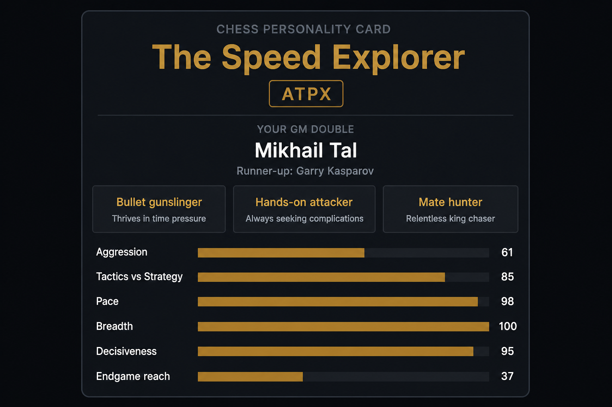

# Chess Signature

Turn your Chess.com and Lichess games into a shareable chess personality report.

**Live demo:** [chess-signature.streamlit.app](https://chess-signature.streamlit.app/)

Paste one or more usernames, wait for the fetch, get a full HTML report you can screenshot or download.

[](https://www.python.org/)
[](https://chess-signature.streamlit.app/)
[](LICENSE)
[](https://github.com/ahmed5145/chess_signature/actions/workflows/ci.yml)



## What you get

- Personality card with a 4-letter style code and a playful GM double
- Board heatmaps (where your pieces land and die)
- Opening repertoire, weapons, and nemeses
- Rating curves, streaks, color edge, win rate by hour (UTC)
- Fun counters: captures, castles, promotions, fastest mate, and more
- Offline HTML download (Plotly bundled)

Style axes are heuristics from your games only. No engine eval, no API keys required for Chess.com.

## Try it online

1. Open [chess-signature.streamlit.app](https://chess-signature.streamlit.app/)
2. Enter Chess.com and/or Lichess usernames (comma-separated, up to 6 total)
3. Click **Generate report**
4. Download the HTML if you want a file that works offline

Large accounts can take a few minutes. Times in the report are UTC.

## Run locally

```bash
python -m venv .venv
# Windows:
.venv\Scripts\activate
# macOS / Linux:
source .venv/bin/activate

pip install -r requirements.txt
streamlit run app.py
```

### CLI (cache on disk, no Streamlit)

1. Edit usernames at the top of `fetch_games.py`
2. Fetch and cache games, then render HTML:

```bash
python fetch_games.py
python make_signature.py
```

Open `chess_signature.html` in a browser. Re-run `make_signature.py` anytime without hitting the APIs again.

Optional Lichess rate-limit boost:

```bash
set LICHESS_TOKEN=xxxxx
python fetch_games.py
```

## Project layout

| File | Role |
|------|------|
| `app.py` | Streamlit UI |
| `fetch_games.py` | Chess.com + Lichess fetch (`fetch_all`) |
| `make_signature.py` | Report builder (`build_html`) |
| `requirements.txt` | Dependencies |
| `.github/workflows/ci.yml` | Import + tiny report smoke test |

## Notes

- Public APIs only. Chess.com asks for a descriptive User-Agent (included).
- Lichess token is optional (Advanced panel in the app, or `LICHESS_TOKEN` for CLI).
- Cap of 6 accounts per run in the web app to keep free hosting happy.

## License

MIT. See [LICENSE](LICENSE).
